# 浙江省调在线建模工程架构图集

本文档用 Mermaid 描述 `zhejiangforecast_zj` 当前工程的主要关系、流程和数据库结构。图中的核心约束是：风电/光伏 EC 模型的训练特征 `X` 只来自 NWP 提取后的特征，标签 `y` 只使用 `power_mw`；推理阶段不依赖实发数据或 label。

## 1. 总体架构关系图

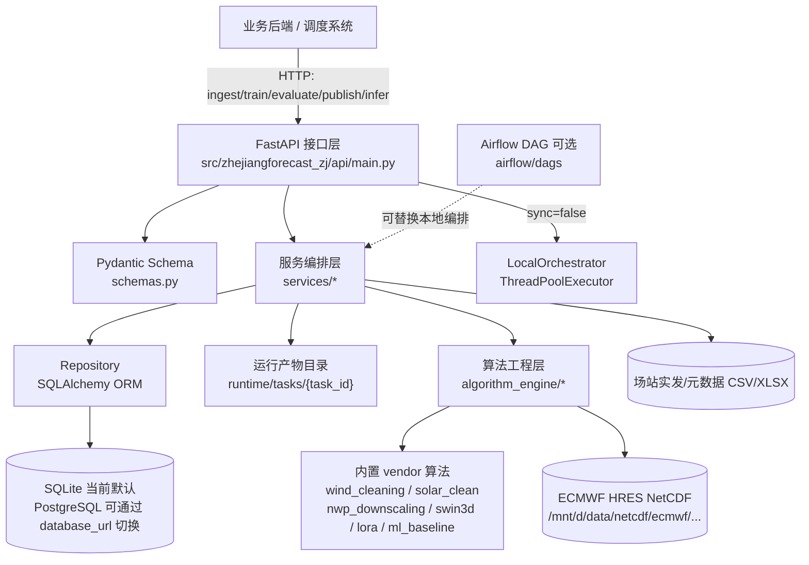

## 2. 模块依赖关系图

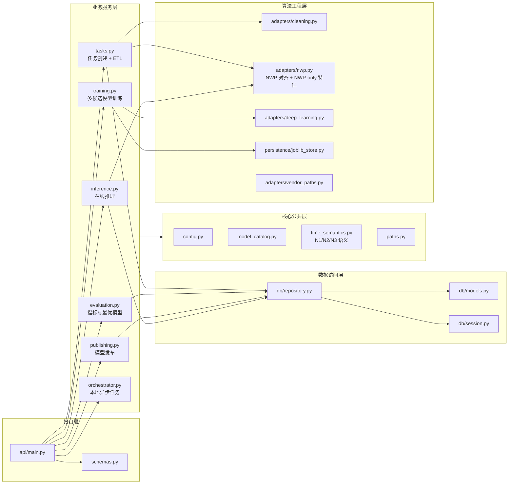

## 3. 任务生命周期状态图

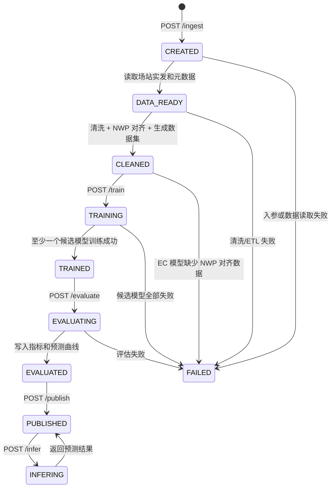

## 4. 在线建模主时序图

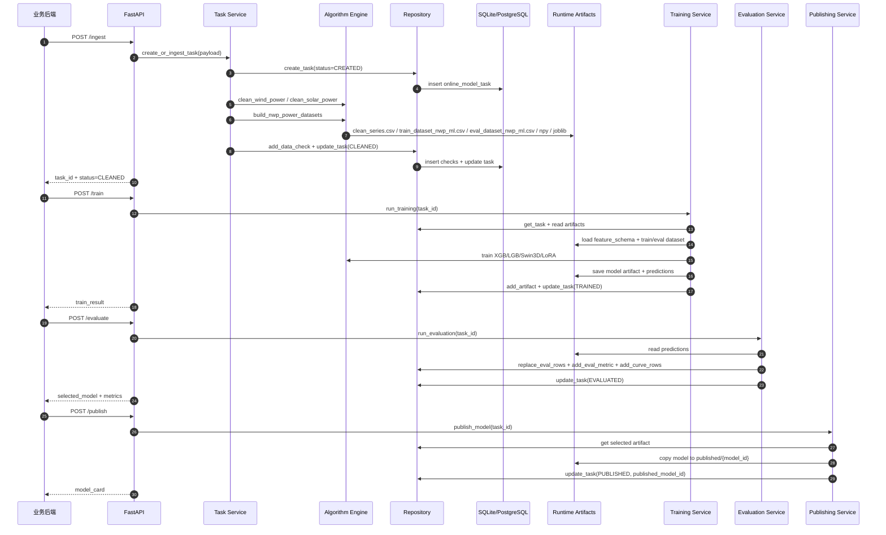

## 5. ETL 与特征契约流程图

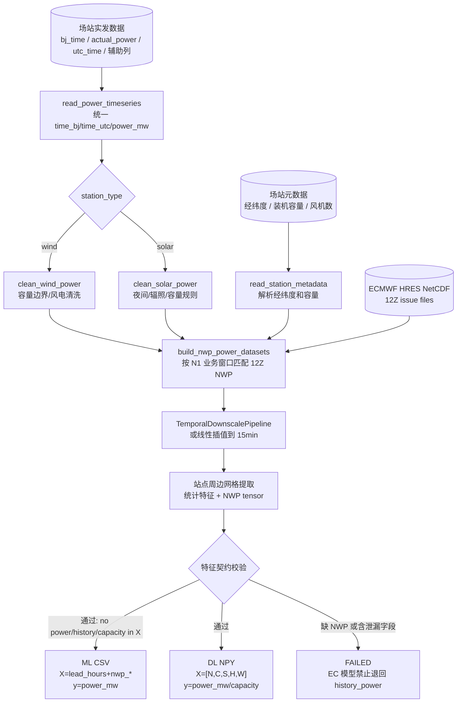

## 6. 训练、评估与模型选择流程图

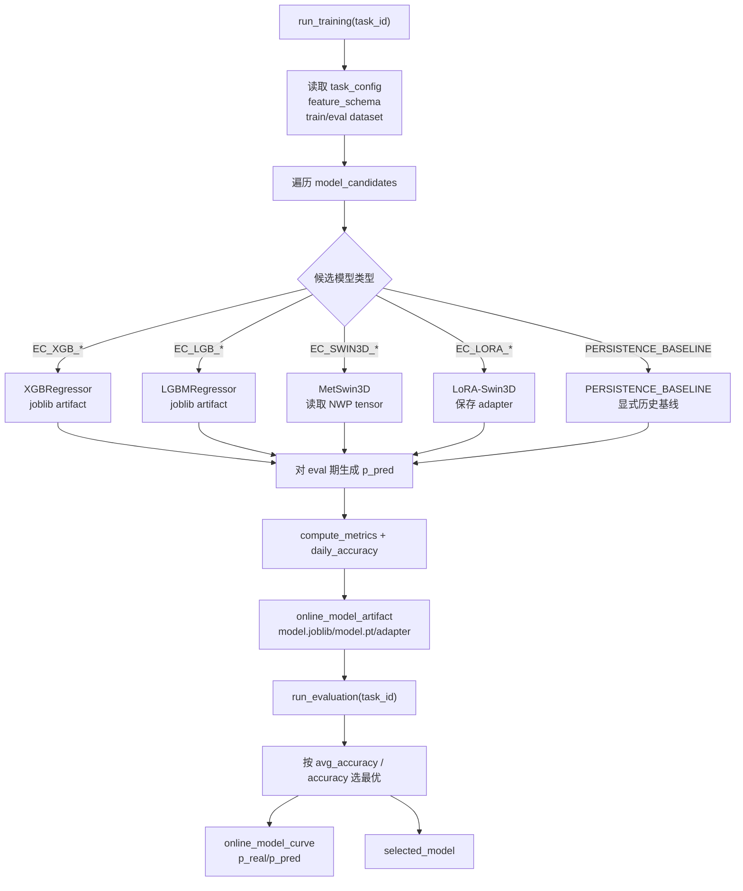

## 7. 推理阶段时序图

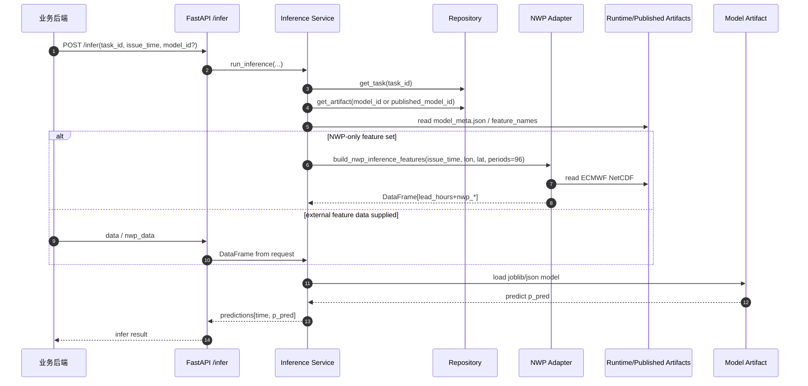

推理阶段的关键点：

- 对 EC XGB/LGB 风光模型，`feature_names` 必须是 `lead_hours` 或 `nwp_*`。
- `build_nwp_inference_features` 只读 NWP、场站经纬度、起报时间，不读取 `power_mw`。
- 返回 96 个 15 分钟点时，业务后端不需要提供实发功率。

## 8. 数据库 ER 图

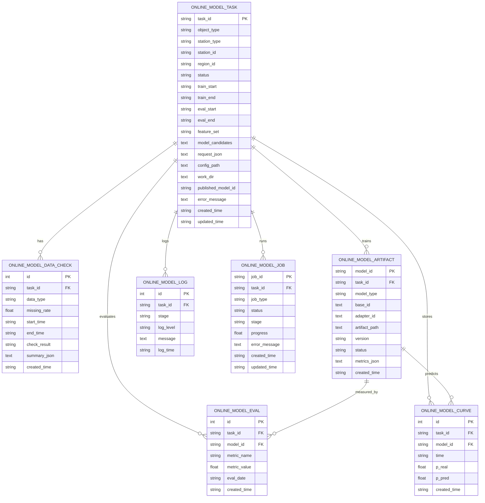

## 9. Runtime 产物关系图

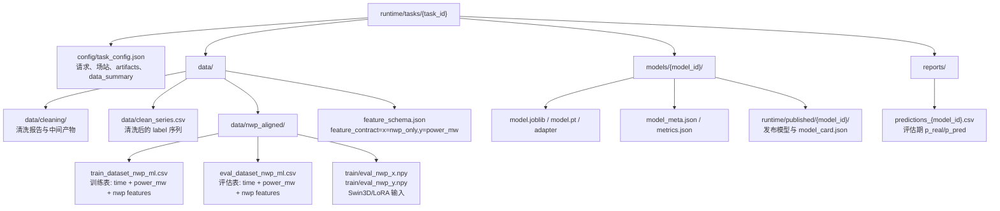

## 10. Airflow / 本地编排关系图

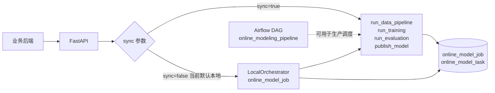

## 11. 模型与数据契约关系图

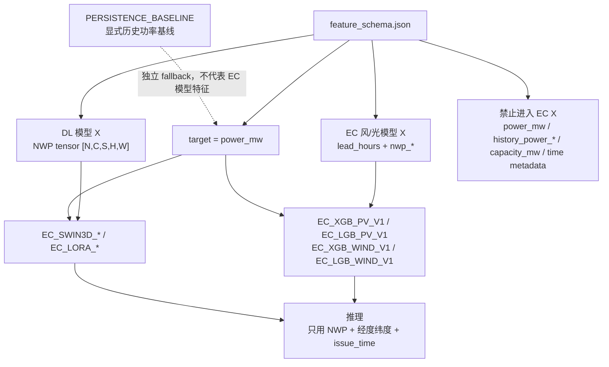

## 12. 业务后端最小调用顺序

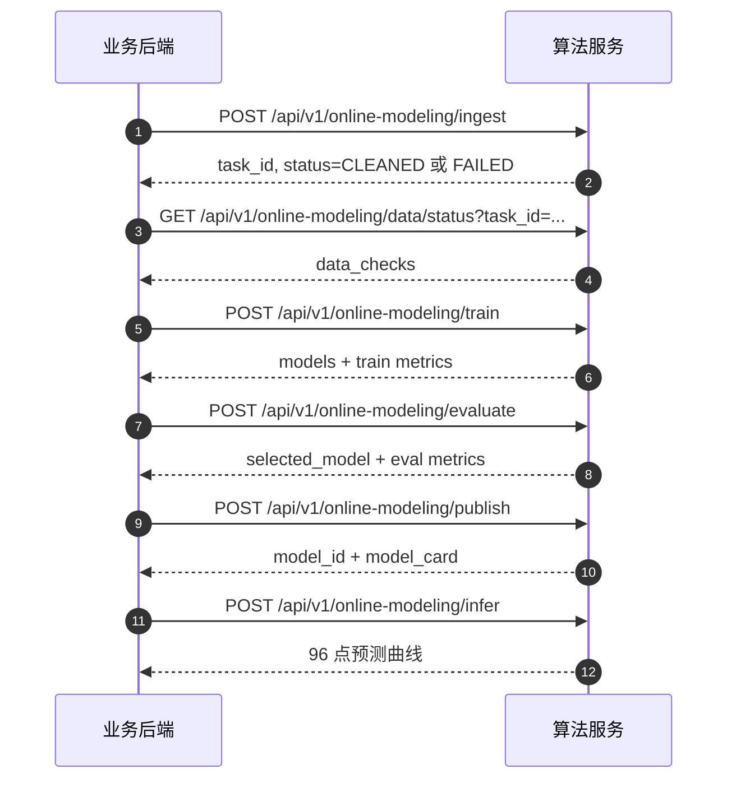

